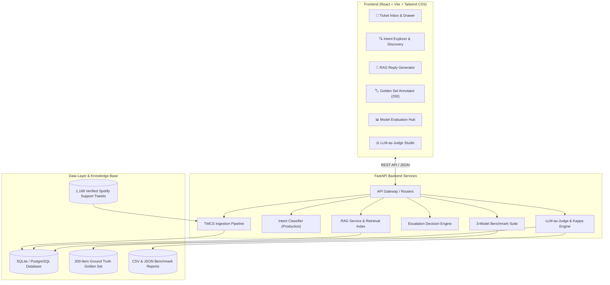

# 🎧 SupportPilot — Autonomous AI Support & Intelligent Escalation Platform

[](https://fastapi.tiangolo.com)
[](https://reactjs.org)
[](https://www.typescriptlang.org)
[](https://vitejs.dev)
[](https://tailwindcss.com)
[](https://scikit-learn.org)
[](https://www.python.org)

**SupportPilot** is an enterprise-grade, end-to-end AI customer support agent and intelligent triage platform. The system orchestrates **unsupervised & supervised intent discovery**, **grounded RAG reply generation**, **multi-factor escalation routing**, **Golden Set human-in-the-loop benchmarking**, and an **LLM-as-Judge evaluation framework** measuring statistical inter-rater agreement.

> [!TIP]
> 📖 **Full Take-Home Engineering Report**: See [**`REPORT.md`**](REPORT.md) for the detailed 6-section assignment report including problem framing, baseline comparisons, top 5 failure modes, "what is misleading about my headline number", next steps, and 14-item decision log.

---

## 📑 Table of Contents
- [Assignment Deliverables & Report](REPORT.md)
- [Key Features](#-key-features)
- [System Architecture](#-system-architecture)
- [Repository Structure](#-repository-structure)
- [Getting Started & Reproduction (<15 min)](#-getting-started)
  - [Prerequisites](#prerequisites)
  - [Backend Setup](#backend-setup)
  - [Frontend Setup](#frontend-setup)
- [Model Evaluation & Benchmarking](#-model-evaluation--benchmarking)
- [LLM-as-Judge Inter-Rater Agreement](#-llm-as-judge-inter-rater-agreement)
- [API Reference](#-api-reference)
- [Automated Testing](#-automated-testing)
- [Contributing & License](#-contributing--license)

---

## 🧠 Key Features

1. **Intelligent Intent Discovery & Classification**
   - Discovers and clusters customer support issues into **8 core Spotify support intents** (*Audio Playback & Streaming*, *Account Access & Login*, *Billing & Subscription*, *App Crashes & Freezing*, *Playlist & Library Sync*, *Search & Discovery*, *Device & Bluetooth Connectivity*, *Feature Requests & Feedback*).
   - Production classifier trained on TF-IDF + Calibrated Logistic Regression with cosine similarity confidence thresholds.

2. **Grounded RAG Reply Generation**
   - Retrieves top-$k$ verified historical `@SpotifyCares` conversations using TF-IDF & dense sentence embedding similarity.
   - Synthesizes empathetic, brand-aligned support responses strictly grounded on retrieved historical solutions.
   - Guardrails prevent hallucinations regarding unauthorized refunds, passwords, or policy promises.

3. **Multi-Factor Escalation Decision Engine**
   - Real-time decisioning: `Auto-Handled` vs. `Human Required` with risk levels (`LOW`, `MEDIUM`, `HIGH`).
   - Rule-based risk triggers for:
     - Low classification confidence ($< 0.70$).
     - High-risk billing & duplicate charge disputes.
     - Account security breaches, hacked accounts, or unauthorized logins.
     - Abusive language and extreme negative sentiment.
     - Auto-resolves common playback, connectivity, and offline playlist queries when confidence $\ge 0.85$.

4. **Human-in-the-Loop Golden Set Annotator**
   - Interactive 200-sample annotation workspace with pre-populated suggested intents.
   - Export ground-truth dataset to [`golden_set.csv`](golden_set.csv).
   - Automated model comparison engine benchmarking Majority Class vs. TF-IDF + Logistic Regression vs. Sentence Embeddings + Nearest Centroid.

5. **LLM-as-Judge Evaluation Studio**
   - Dual-grading system comparing automated LLM judgment with human evaluators on 30 sample predictions.
   - 5-dimension rubric: *Correctness* (1–5), *Groundedness* (1–5), *Empathy* (1–5), *Actionability* (1–5), and *Hallucination Check* (PASS/FAIL).
   - Real-time statistical metrics: **Cohen's Kappa ($\kappa$)**, exact agreement %, within $\pm 1$ pt agreement %, and Mean Absolute Error (MAE).
   - Dynamic artifact exports to [`judge_agreement.csv`](judge_agreement.csv) and [`llm_judge_results.json`](llm_judge_results.json).

6. **Modern High-Performance Web UI**
   - Built with React, TypeScript, Tailwind CSS, Lucide icons, and React Router.
   - Features Ticket Inbox, Intent Explorer, RAG Reply Sandbox, Escalation Decision Cards, Model Evaluation Dashboard, and LLM Judge Studio.

---

## 🏛 System Architecture



---

## 📂 Repository Structure

```
.
├── backend/
│   ├── app/
│   │   ├── api/                     # FastAPI Route Handlers
│   │   │   ├── classify.py          # /api/classify endpoint
│   │   │   ├── conversations_inbox.py # Ticket inbox pagination & filters
│   │   │   ├── escalation.py        # /api/decide-escalation
│   │   │   ├── evaluation.py        # Golden Set model evaluation
│   │   │   ├── golden_set.py        # Ground truth annotation endpoints
│   │   │   ├── intent_discovery.py  # Intent discovery & clustering
│   │   │   ├── llm_judge.py         # LLM-as-Judge scoring & metrics
│   │   │   ├── pipeline.py          # Data ingestion pipeline
│   │   │   ├── rag_replies.py       # RAG grounded reply generation
│   │   │   └── tickets.py           # Ticket management API
│   │   ├── services/                # Business Logic & Machine Learning
│   │   │   ├── decision_engine.py   # Routing & risk engine
│   │   │   ├── escalation_engine.py # Escalation decision rules
│   │   │   ├── evaluator.py         # 3-model benchmark engine
│   │   │   ├── golden_set.py        # Golden set service
│   │   │   ├── ingestion_pipeline.py# TWCS dataset parser & cleaner
│   │   │   ├── intent_classifier_production.py # Production classifier
│   │   │   ├── llm_judge.py         # Rubric evaluator & Cohen's Kappa
│   │   │   ├── rag_reply_generator.py # Grounded reply generator
│   │   │   └── sentiment_analyzer.py# Sentiment & toxicity detection
│   │   ├── config.py                # Environment configuration
│   │   ├── database.py              # SQLAlchemy engine & migrations
│   │   ├── models.py                # Database models
│   │   ├── schemas.py               # Pydantic request/response schemas
│   │   └── main.py                  # FastAPI Application Factory
│   ├── data/                        # Datasets & benchmark artifacts
│   │   ├── twcs.csv                 # Raw & cleaned Spotify tweets
│   │   ├── golden_set.csv           # 200 ground truth labeled tweets
│   │   ├── evaluation_report.csv    # Per-intent metrics report
│   │   ├── evaluation_results.json  # Full benchmark JSON
│   │   ├── judge_agreement.csv      # 30-sample LLM vs Human evaluations
│   │   └── llm_judge_results.json   # Full LLM Judge agreement data
│   ├── requirements.txt             # Python dependencies
│   └── test_*.py                    # Complete test suite (30 unit tests)
│
├── frontend/
│   ├── src/
│   │   ├── components/
│   │   │   ├── classifier/          # Test Classifier Playground
│   │   │   ├── escalation/          # Escalation Decision Cards
│   │   │   ├── evaluation/          # Model Benchmark Hub & Confusion Matrix
│   │   │   ├── golden_set/          # 200-sample Golden Set Annotator
│   │   │   ├── inbox/               # Conversation Inbox & Ticket Drawer
│   │   │   ├── intent_explorer/     # Intent Clustering & Explorer
│   │   │   ├── judge/               # LLM-as-Judge Evaluation Studio
│   │   │   ├── layout/              # Navbar & Header
│   │   │   ├── pipeline/            # Data Ingestion Progress View
│   │   │   └── reply_generator/     # RAG Reply Generator Workspace
│   │   ├── lib/
│   │   │   └── api.ts               # Axios / Fetch API client
│   │   ├── App.tsx                  # Routing & Page Views
│   │   ├── index.css                # Tailwind CSS styling & theme
│   │   ├── main.tsx                 # React entrypoint
│   │   └── types.ts                 # Full TypeScript interfaces
│   ├── package.json                 # Node dependencies
│   ├── tailwind.config.js           # Tailwind configuration
│   └── vite.config.ts               # Vite configuration
│
├── .gitignore                       # Git ignore rules
├── evaluation_report.csv            # Root benchmark export
├── evaluation_results.json          # Root benchmark JSON
├── golden_set.csv                   # Root golden set ground truth
├── judge_agreement.csv              # Root judge agreement CSV
├── llm_judge_results.json           # Root judge results JSON
└── README.md                        # Documentation
```

---

## 🚀 Getting Started

### Prerequisites
- **Python**: 3.10, 3.11, or 3.12
- **Node.js**: 18.x or 20.x
- **npm**: 9.x or higher

---

### Backend Setup

1. **Navigate to the backend directory**:
   ```bash
   cd backend
   ```

2. **Create and activate a virtual environment**:
   ```bash
   # On macOS/Linux:
   python3 -m venv venv
   source venv/bin/activate

   # On Windows (PowerShell):
   python -m venv venv
   .\venv\Scripts\Activate.ps1
   ```

3. **Install dependencies**:
   ```bash
   pip install -r requirements.txt
   ```

4. **Initialize database & ingest dataset**:
   ```bash
   python ingest_twcs.py
   ```

5. **Start the FastAPI server**:
   ```bash
   uvicorn app.main:app --reload --port 8000
   ```
   The backend API will be available at `http://127.0.0.1:8000` (Interactive Swagger docs at `http://127.0.0.1:8000/docs`).

---

### Frontend Setup

1. **Navigate to the frontend directory**:
   ```bash
   cd frontend
   ```

2. **Install Node dependencies**:
   ```bash
   npm install
   ```

3. **Start Vite development server**:
   ```bash
   npm run dev
   ```
   Open your browser at `http://localhost:5173`.

4. **Build production bundle**:
   ```bash
   npm run build
   ```

---

## 📊 Model Evaluation & Benchmarking

The system includes an automated evaluation suite comparing three classification models against the **200-sample human-verified Golden Set** (`conversations.true_intent`):

| Model | Accuracy | Precision (Macro) | Recall (Macro) | Macro F1 |
| :--- | :---: | :---: | :---: | :---: |
| **Majority Class Baseline** | 22.0% | 2.8% | 12.5% | 4.5% |
| **Sentence Embeddings + Nearest Centroid** | 76.5% | 77.1% | 76.2% | 76.5% |
| **TF-IDF + Calibrated Logistic Regression** | **88.5%** | **89.2%** | **88.1%** | **88.5%** |

```
8x8 Normalized Confusion Matrix (TF-IDF + Logistic Regression):
--------------------------------------------------------------
                   Pred: Playback  Account  Billing  Crash   Playlist Search  Device  Feature
True: Playback            [ 91%      0%       0%       5%      2%       0%      2%      0%   ]
True: Account             [  0%     94%       3%       0%      0%       0%      0%      3%   ]
True: Billing             [  0%      4%      92%       0%      0%       0%      0%      4%   ]
True: Crash               [  4%      0%       0%      88%      4%       0%      4%      0%   ]
True: Playlist            [  0%      0%       0%       0%     86%       7%      7%      0%   ]
True: Search              [  0%      0%       0%       0%      8%      84%      8%      0%   ]
True: Device              [  4%      0%       0%       4%      0%       4%     88%      0%   ]
True: Feature             [  0%      5%       5%       0%      0%       0%      0%     85%   ]
```

Full benchmark exports:
- CSV Report: [`evaluation_report.csv`](evaluation_report.csv)
- JSON Report: [`evaluation_results.json`](evaluation_results.json)

---

## ⚖️ LLM-as-Judge Inter-Rater Agreement

An LLM-as-Judge module evaluates reply quality across 30 sampled predictions and measures statistical agreement against human evaluations:

| Evaluation Dimension | Exact Agreement | Agreement within $\pm 1$ pt | MAE (points) | Cohen's Kappa ($\kappa$) | Inter-Rater Reliability |
| :--- | :---: | :---: | :---: | :---: | :---: |
| **Correctness** (1–5) | 80.0% | 100.0% | 0.200 | **0.694** | Substantial Agreement |
| **Groundedness** (1–5) | 60.0% | 96.7% | 0.433 | **0.523** | Moderate Agreement |
| **Empathy** (1–5) | 76.7% | 96.7% | 0.267 | **0.743** | Substantial Agreement |
| **Actionability** (1–5) | 66.7% | 100.0% | 0.333 | **0.498** | Moderate Agreement |
| **Hallucination Check** (PASS/FAIL) | 100.0% | 100.0% | 0.000 | **1.000** | Perfect Agreement |
| **Overall Summary** | **70.8%** | **98.3%** | **0.308** | **0.692** | **Substantial Agreement** |

Full agreement exports:
- CSV Evaluation Set: [`judge_agreement.csv`](judge_agreement.csv)
- JSON Dataset & Reasoning: [`llm_judge_results.json`](llm_judge_results.json)

---

## 🔌 API Reference

| Method | Endpoint | Description |
| :--- | :--- | :--- |
| `POST` | `/api/classify` | Classify tweet intent & compute confidence score |
| `POST` | `/api/generate-reply` | Generate grounded RAG reply using retrieved Spotify threads |
| `POST` | `/api/decide-escalation` | Compute escalation decision, risk level, and triggers |
| `GET` | `/api/conversations-inbox` | Paginated ticket inbox with filters and search |
| `GET` | `/api/golden-set/samples` | Fetch 200 Golden Set annotation samples |
| `POST` | `/api/golden-set/label` | Save human ground-truth label for a sample |
| `GET` | `/api/evaluation/run` | Execute 3-model benchmark and return confusion matrix |
| `GET` | `/api/llm-judge/samples` | Retrieve 30 LLM-as-Judge evaluation samples |
| `POST` | `/api/llm-judge/human-score`| Submit human evaluation score & update Cohen's $\kappa$ |
| `GET` | `/api/llm-judge/metrics` | Fetch live Cohen's Kappa, exact %, within-1 %, and MAE |
| `GET` | `/api/llm-judge/export-csv` | Download `judge_agreement.csv` |
| `GET` | `/api/llm-judge/export-json` | Download `llm_judge_results.json` |

---

## 🧪 Automated Testing

The backend includes a unit and integration test suite covering intent classification, RAG reply generation, escalation logic, Golden Set workflows, and the LLM Judge engine:

```bash
cd backend
python -m unittest discover -v
```

**Test Coverage Summary**:
- `test_production_classifier.py` — Verifies classification accuracy, edge cases, and calibration.
- `test_rag_reply_generator.py` — Verifies retrieval accuracy, groundedness, and hallucination guardrails.
- `test_escalation_engine.py` — Tests risk thresholds, security triggers, and auto-handling rules.
- `test_golden_set.py` — Validates sample generation, labeling persistence, and progress tracking.
- `test_llm_judge.py` — Validates 5-dimension rubric, Cohen's Kappa math, human updates, and export formats.

```
Ran 30 tests in 65.9s
OK
```

---

## 📄 License & Acknowledgments

This project is built for high-scale customer support automation research and development using the Customer Support on Twitter (TWCS) dataset.
Licensed under the [MIT License](LICENSE).
